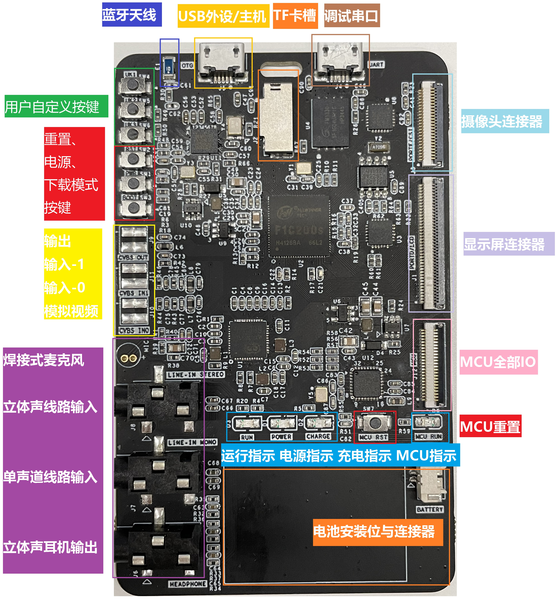

# 2020年西湖论剑-IoT闯关赛

## 硬件配置
本次比赛设计了一块兼具MPU与MCU的开发板，可以同时运行Linux操作系统和AVR裸机程序，关键配置如下
- 主控：Allwinner F1C200s ARM926EJS@408MHz 集成 64MB DDR-I
- MCU：ATMEL ATmega328P-MU 具有外部16MHz晶振
- 无线：Broadcom BCM20702A1 BR/BLE 4.0
- 存储：GigaDevice GD5F1GQ4UAYIG 128MByte NAND Flash
- 电源：X-Powers AXP199 电源管理单元
- 串口：SiliconLabs CP2104 USB转UART桥

其中MPU与MCU使用0号IIC总线通信，并包含一路中断信号。

## 接口分布示意图
开发板包含了充分的扩展接口，这些接口不仅仅是为比赛服务的，同时也提供了更多可能的扩展性。



## 已知问题及缓解措施
就像开发软件系统一样，硬件开发同样会遇到BUG。好在这些BUG并不会影响我们比赛项目的进行，但如果你打算用它去做一些自己的DIY的话，可能要注意以下问题：
- UART接口会在板子关机状态下由TX/RX引脚倒灌电流，可能一些微功率器件无法正确断电，如LED可能微微发亮，MCU仍在运行等问题。可以将R10 R11的位置改为NMOS开漏电路解决这个问题，或者在断电后拔出UART接口的USB线。
- UART接口会占用CSI0的HSYNC/VSYNC引脚，在默认配置下将导致摄像头不可用。可以断开R10 R11两颗电阻并屏蔽UART0功能来启用摄像头功能。但注意这也会失去串口调试的功能，请预先正确配置SSH服务。
- RTC芯片无法正常工作，系统断电后无法保存时间，可以选择兼容3.3V工作电压的国产DS1307Z+代换U5修复。
- 在关机状态下OTG接口无法充电，可以通过UART接口充电或者开机状态下使用OTG接口充电。
- 显示屏背光使能引脚默认为高阻状态无上拉，会导致LCD背光闪屏。可以自行编写AXP199电源管理芯片的PWM1驱动或者在U7的第四脚接一10K电阻到U6的第四脚来解决这个问题。

## 如何更新固件、写入题目
我们推荐使用Linux操作系统来进行这一操作，接下来也会以Ubuntu 18.04为演示环境进行演示。

全志平台的处理包含一个内置的FEL模式，该模式允许直接使用USB接口向内存写入机器码来实现其他功能，可以通过按下BOOT键不松手的同时短按RST键的方式进入，**一般情况下我们不会使用这种模式。**

在这块开发板上，我们在bootloader中预置了DFU模式用于快速更新固件。比较关键的两个分区是"all"和"vendor"，其中"all"的部分为整个固件，刷写时间比较长。"vendor"包含了题目数据，在启动的时候会被挂载到/workspace路径下，由于题目数据较小，可以很快的完成刷写。

可以使用下面这个命令安装dfu工具
> apt install dfu-util

以下脚本可以实现和比赛时相同的刷机操作，它会等待板子正确连接后，向指定分区下发镜像。在没有配置udev规则的环境下，这些脚本依赖root权限。

> 刷机步骤
> - 运行刷机脚本
> - 将USB OTG线连接到PC
> - 短按RST按钮
> - 等待刷机脚本结束

> 刷写完整镜像
> ```shell
> #!/bin/bash
> SELFDIR=`dirname \`realpath ${0}\``
> cd ${SELFDIR}
> echo -n "Waiting for DFU Device";
> while [ -z "`dfu-util -l | grep 'Found DFU'`" ]
> do
>     echo -n ".";
> done
> echo "Gotcha!";
> dfu-util -R -a all -D sysimage-nand.img
> ```
> 刷写某个题目
> ```shell
> #!/bin/bash
> SELFDIR=`dirname \`realpath ${0}\``
> cd ${SELFDIR}
> echo -n "Waiting for DFU Device";
> while [ -z "`dfu-util -l | grep 'Found DFU'`" ]
> do
>     echo -n ".";
> done
> echo "Gotcha!";
> dfu-util -R -a vendor -D RADIO1-adv_sign.squashfs
> ```
其区别就在最后一行传入dfu-util的参数，具体的含义可以运行**dfu-util --help**查看。

因为本开发板使用了overlayfs技术，如果出现了文件系统混乱的情况，请运行**mtd -r erase /dev/mtd4**来清除刷机后的所有更改。注意，这个指令并不会破坏主固件，其行为更接近"恢复出厂设置"。

如果bootloader意外损坏，可以先进入FEL模式，然后参考**flash-bootloader.sh**进行修复。
